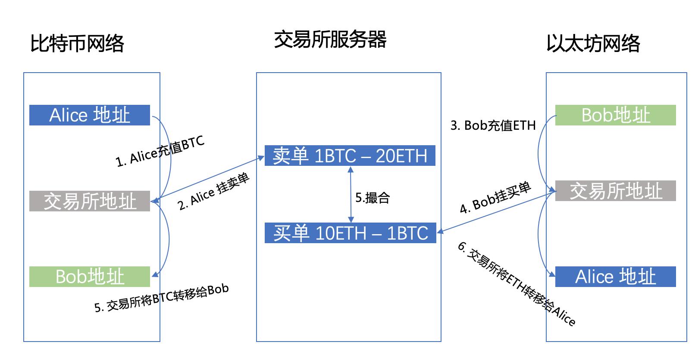
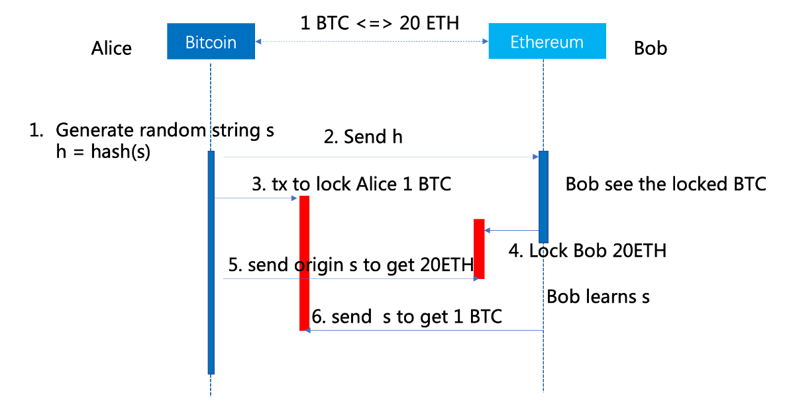
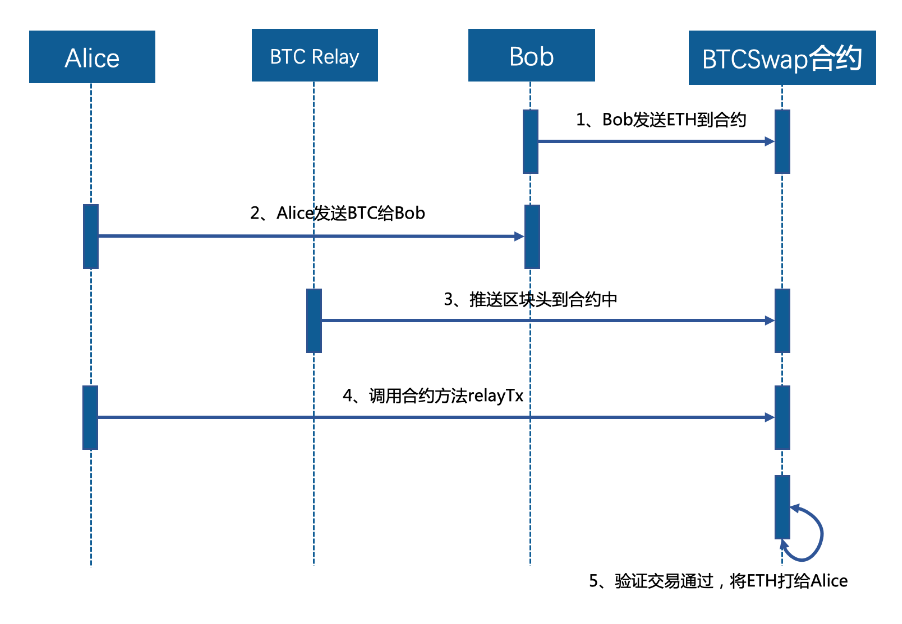

# 区块链技术与应用小白书

[胡成武](https://github.com/Colinhuu)（著）&copy; 2019

> `如果不能遇见你，让我遇见更好的自己。`

《区块链技术与应用小白书》-小白也能懂的区块链技术书。本书源码托管在Github，您可以[点此]((https://github.com/Colinhuu))进入，欢迎大家Star或给作者提PR(Pull requests)。

-----
## 0 引言

2019年10月24日[习近平在中央政治局第十八次集体学习时的讲话](http://www.xinhuanet.com/politics/2019-10/25/c_1125153665.htm)

> 习近平在主持学习时发表了讲话。目前，全球主要国家都在加快布局区块链技术发展。我国在区块链领域拥有良好基础，要加快推动区块链技术和产业创新发展，积极推进区块链和经济社会融合发展。
    
......

区块链是对过往技术的重新组合，是现阶段信息科技创新的高潮。区块链 通过一种全新的信任机制--去信任化(Trustless)，使网络中不熟悉的节点间 也可以直接建立信任关系，每个节点有相同的网络权力，不再存在中心化的服 务器，任一节点停止工作都不会影响系统整体的运作。可以说，以往技术带来 的是生产力的提升，而区块链带来的是生产关系的改变。新的生产关系构建带 来的效率、安全提升将对各行业产生深远影响。

作为互联网从业者，我从2018年初正式关注区块链技术的发展，致力于区块链技术与线下实体产业的融合，在学习区块链的过程中会发现很多生涩难懂的术语，于是边学习边整理，故有此书。当然目前此书的目录排版以及内容，可能都不完善或者有其他待商榷的地方，欢迎大家指正，也希望借此能认识更多的同行者。本书仅作为学习参考使用，部分内容来自于网络，如有侵权，请联系作者删除。

胡成武，二〇一九年十一月，于杭州

## 1 区块链基础

### 1.1 起源-不得不提的比特币

比特币（Bitcoin）的概念最初由中本聪在2008年11月1日提出，并于2009年1月3日正式诞生。根据中本聪的思路设计发布的开源软件以及建构其上的P2P网络。比特币是一种P2P形式的虚拟的加密数字货币。点对点的传输意味着一个去中心化的支付系统。

与所有的货币不同，比特币不依靠特定货币机构发行，它依据特定算法，通过大量的计算产生，比特币经济使用整个P2P网络中众多节点构成的分布式数据库来确认并记录所有的交易行为，并使用密码学的设计来确保货币流通各个环节安全性。P2P的去中心化特性与算法本身可以确保无法通过大量制造比特币来人为操控币值。基于密码学的设计可以使比特币只能被真实的拥有者转移或支付。这同样确保了货币所有权与流通交易的匿名性。比特币与其他虚拟货币最大的不同，是其总数量非常有限，具有极强的稀缺性。

具体可以参考比特币白皮书：[比特币:一种点对点的电子现金系统](http://blockchainhandbooks.com/file/比特币白皮书.pdf)

### 1.2 基础概念

####        1.2.1 区块与区块链

大家可能都听过姐弟恋、异地恋、就是没听过区块链，今天我们来聊一聊区块链是个什么链？

**区块链**（英语：blockchain或 block chain）是借由密码学串接并保护内容的串连交易记录（又称区块）。每一个区块包含了前一个区块的加密散列、相应时间戳记以及交易数据（通常用默克尔树(Merkle tree)算法计算的散列值表示）

狭义来讲，是一种按照时间顺序将数据区块以顺序相连的方式组合成的一种链式数据结构， 并以密码学方式保证的不可篡改和不可伪造的分布式账本。

广义来讲，是利用块链式数据结构来验证与存储数据、利用分布式节点共识算法来生成和更新数据、利用密码学的方式保证数据传输和访问的安全、利用由自动化脚本代码组成的智能合约来编程和操作数据的一种全新的分布式基础架构与计算方式

可以把区块链理解成一种分布式的交易的共享账本。交易信息将被整理并打包记录在区块中。区块链是一种数据结构，这种结构的数据可以看成是一系列链 接的队列，这些队列通过哈希指针进行关联(与传统意义上的普通指针要区分开， 哈希指针用来指向前一个区块)。

比特币中的链式结构如下:


 
主要分为：公有链、联盟链、私有链

>**公有链/ Public Blockchain**

公有链的任何节点都是向任何人开放的，每个人都可以参与到这个区块链中的计算，而且任何人都可以下载获得完整区块链数据，即全部账本。

>**联盟链/ Consortium Blockchain**

联盟链是指参与每个节点的权限都完全对等，各节点在不需要完全互信的情况下就可以实现数据的可信交换，联盟链的各个节点通常有与之对应的实体机构组织，通过授权后才能加入或退出网络。联盟链是一种公司与公司、组织与组织之间达成联盟的模式。

>**私有链/ Private Blockchain**

在某些区块链的应用场景下，开发者并不希望任何人都可以参与这个系统，因此建立一种不对外公开、只有被许可的节点才可以参与并且查看所有数据的私有区块链，私有链一般适用于特定机构的内部数据管理与审计。

####        1.2.2 Merkle Tree
默克尔树（Merkle tree，MT）是一种哈希二叉树，1979年由Ralph Merkle发明。在计算机科学中，二叉树是每个节点最多有两个子树的树结构，每个节点代表一条结构化数据。通常子树被称作“左子树”（left subtree）和“右子树”（right subtree）。二叉树常被用于实现数据快速查询。二叉树如下图所示。


>**1).Merkle树结构**

由一个根节点（root）、一组中间节点和一组叶节点（leaf）组成。叶节点（leaf）包含存储数据或其哈希值，中间节点是它的两个孩子节点内容的哈希值，根节点也是由它的两个子节点内容的哈希值组成。所以Merkle树也称哈希树。

>**2).哈希树的特点**

叶节点存储的是数据文件，而非叶节点存储的是其子节点的哈希值（Hash，通过SHA1、SHA256等哈希算法计算而来），这些非叶子节点的Hash被称作路径哈希值（可以据其确定某个叶节点到根节点的路径）, 叶节点的Hash值是真实数据的Hash值。因为使用了树形结构, 其查询的时间复杂度为 O(logn)，n是节点数量。


默克尔树的另一个特点是，底层数据的任何变动，都会传递到其父节点，一直到树根。

>**3).应用模式**

默克尔树的典型应用场景包括：
* **快速比较大量数据**：当两个默克尔树根相同时，则意味着所代表的数据必然相同（哈希算法决定的）。
* **快速定位修改**：例如上例中，如果 D1 中数据被修改，会影响到Hash0-0，Hash0 和 Root。因此，沿着 Root --> 0 --> 0-0，可以快速定位到发生改变的 D1；
* **零知识证明**：例如如何证明某个数据（D0……D3）中包括给定内容 D0，很简单，构造一个默克尔树，公布 N0，N1，N4，Root，D0拥有者可以很容易检测 D0 存在，但不知道其它内容。
相对于 Hash List，MT的明显的一个好处是可以单独拿出一个分支来（作为一个小树）对部分数据进行校验，这个很多使用场合就带来了哈希列表所不能比拟的方便和高效。正是源于这些优点，MT常用于分布式系统或分布式存储中

>**4).在分布式存储系统中的应用原理**

为了保持数据一致，分布系统间数据需要同步，如果对机器上所有数据都进行比对的话，数据传输量就会很大，从而造成“网络拥挤”。为了解决这个问题，可以在每台机器上构造一棵Merkle Tree，这样，在两台机器间进行数据比对时，从Merkle Tree的根节点开始进行比对，如果根节点一样，则表示两个副本目前是一致的，不再需要任何处理；如果不一样，则沿着hash值不同的节点路径查询，很快就能定位到数据不一致的叶节点，只用把不一致的数据同步即可，这样大大节省了比对时间以及数据的传输量。

>**5).比特币中的Merkle Tree**

比特币区块链系统中的采用的是Merkle二叉树，它的作用主要是快速归纳和校验区块数据的完整性，它会将区块链中的数据分组进行哈希运算，向上不断递归运算产生新的哈希节点，最终只剩下一个Merkle根存入区块头中，每个哈希节点总是包含两个相邻的数据块或其哈希值。
在比特币系统中使用Merkle树有诸多优点：首先是极大地提高了区块链的运行效率和可扩展性，使得区块头只需包含根哈希值而不必封装所有底层数据，这使得哈希运算可以高效地运行在智能手机甚至物联网设备上；其次是Merkle树可支持“简化支付验证协议”（SPV），即在不运行完整区块链网络节点的情况下，也能够对交易数据进行检验。所以，在区块链中使用Merkle树这种数据结构是非常具有意义的。

####        1.2.3 哈希算法

**散列函数**（英语：Hash function）又称**散列算法、哈希函数**，是一种从任何一种数据中创建小的数字“指纹”的方法。散列函数把消息或数据压缩成摘要，使得数据量变小，将数据的格式固定下来。该函数将数据打乱混合，重新创建一个叫做散列值（hash values，hash codes，hash sums，或hashes）的指纹。散列值通常用一个短的随机字母和数字组成的字符串来代表。好的散列函数在输入域中很少出现散列冲突。在散列表和数据处理中，不抑制冲突来区别数据，会使得数据库记录更难找到。


> **1).确定性(Deterministic)** 

对于同一个输入，无论用哈希函数计算多少次，都会得到相同的结果。
> **2).快速计算** 

对于输入的字符串，能在合理的时间内算出哈希函数的输出，否则会影响系
统的性能。 
> **3).隐秘性**

如果我们已知字符串 A 的哈希值是 H(A)，那么我们没有可行的办法算出 A 是什么。注意，这里说的是 “不可行” 而不是 “不可能”。
在已知哈希值的情况下， 尽管可以通过暴力破解的方法找到输入的字符串 是什么，但这会花费很长长长长长的时间，所以不用担心。

> **4).抗篡改能力** 

对于任意一个输入，哪怕是很小的改动，其哈希改变也会非常大。

> **5).抗碰撞能力** 

碰撞是指，对于相同的输入，经过哈希计算后产生了不同的输出。具有抗碰撞能力就是对于大部分的输入都有独一无二的输入。 这里说的是”大部分”， 因为找不到碰撞，并不意味不存在碰撞。
但对于 SHA -256 之类的哈希函数，需要花费很长的时间来找到碰撞。所以 我们完全可以认为 if H(A) = H(B) 那么 A=B.

**非对称加密**

非对称加密算法是一种密钥的保密方法。非对称加密算法需要两个密钥:公 开密钥(publickey)和私有密钥(privatekey)。 公开密钥与私有密钥是一对， 如果用公开密钥对数据进行加密，只有用对应的私有密钥才能解密;如果用私有 密钥对数据进行加密，那么只有用对应的公开密钥才能解密。


```
1)、A 要向 B 发送信息、A 和 B 都要生成一对用于加密和解密的公钥和私 钥
2)、A 的私钥保密，A 的公钥告诉 B;B 的私钥保密，B 的公钥告诉 A。 
3)、A 要给 B 发送信息时，A 用 B 的公钥加密信息，因为 A 知道 B 的公钥。 
4)、A 将这个消息发给 B(已经用 B 的公钥加密消息)。
5)、B 收到这个消息后，B 用自己的私钥解密 A 的消息。其他所有收到这个报文的人都无法解密，因为只有 B 才有 B 的私钥。
```
####        1.2.4 分叉、孤块与叔块

**分叉**含有数个定义：
* 一条区块链分开成两条区块链
* 一个协议的改变或两个区块拥有相同的高度

分叉可分为**意外分叉**和**有意分叉**。

>**意外分叉**

当两个或以上的矿工在几乎相同的时间成功挖到区块，便会出现意外分叉。 此时，矿工便会分别在两条分叉上各自挖矿，直至其中一条分叉比其他分叉更长。（这代表矿工对采纳哪一个分叉已达成共识）因此，矿工网络随后便会放弃挖掘其他分叉。被抛弃的区块被称为孤立区块。因此，不少密码货币使用者，均要求交易需要多次确认，以防止意外分叉使交易所在之区块变为无效。

>**有意分叉**

有意分叉则对原区块链作出修改，可再分类如下：
新版本和旧版本中的区块能够相互兼容，称为“软分叉”，不能相互兼容就称为“硬分叉”。

* 硬分叉

硬分叉之中新分叉所产生之区块将被旧软件视为无效。因此所有参与者，包括交易服务器以及矿工（节点），都必须更新软件，才能继续运行新分叉。[4]如有节点组继续使用旧软件，而其他节点使用新的软件，便有可能产生分裂成两只货币。

* 软分叉

与硬分叉相比，软分叉所产生之区块能够被旧软件识别为有效区块，即区块 向下兼容。然而，旧软件所产生之区块则未必在新规则下有效。

**孤块(orphan block)**：在比特币协议中，最长的链被认为是绝对的正确。如果一个块不是最长链的一部分，那么它被称为是“孤块”。一个孤立的块是一个块，它也是合法的，但是发现的稍晚，或者是网络传输稍慢，而没有能成为最长的链的一部分。在比特币中，孤块没有意义，随后将被抛弃，发现这个孤块的矿工也拿不到采矿相关的奖励。

而在以太坊中，不能跻身主链的区块都是孤块，如果这些孤块能够被后来的区块通过Uncle字段收留，则这些孤块会成为叔块

**“叔块”(uncle block)**：Ethereum的GHOST协议，不认为孤块没有价值，而是会给与发现孤块的矿工以回报。在以太坊中，孤块被称为“叔块”(uncle block)，它们可以为主链的安全作出贡献。
叔块的奖励计算有些复杂，公式为：
```
叔块奖励 = ( 叔块高度 + 8 - 包含叔块的区块的高度 ) * 普通区块奖励 / 8
```

####        1.2.5 分布式、P2P、非对称加密
> **0).点对点/ Peer-to-Peer / P2P**

通过允许单个节点与其他节点直接交互，无需通过中介机构，从而实现整个系统像有组织的集体一样运作的系统。

> **1).去中心化**

去中心化是互联网发展过程中形成的社会关系形态和内容，是相对于“中心化”而言的新型网络内容的生产过程。在计算机技术领域，去中心化结构使用分布式核算和存储，不存在中心化的节点，任意节点的权利和义务都是均等的，系统中的数据块由整个系统中具有维护功能的节点来共同维护，任一节点停止工作都不会影响系统整体的运作。

> **2).分布式**

分布式网络存储技术是将数据分散的存储于多台独立的机器设备上。分布式网络存储系统采用可扩展的系统结构，利用多台存储服务器分担存储负荷，利用位置服务器定位存储信息，不但解决了传统集中式存储系统中单存储服务器的瓶颈问题，还提高了系统的可靠性、可用性和扩展性，这种组织方式能有效提升信息的传递效率。

> **3).两者的异同**

下图能够很好地反映“中心化”、“去中心化”、“分布式”、“点对点”的异同。


关于“去中心化”和“分布式”的区别大概可以总结为：去中心化是分布式网络结构中的一种，所有的去中心化都是采用分布式网络结构的，而分布式网络结构可能是“中心化”也可能是“去中心化”的。

**去中心化**：相对于“中心化”概念，在去中心化的系统网络里，每一个参与者（节点）都是平等且自由的关系，没有谁依赖谁。

**多中心化**：和去中心化有一些相近， 由多个中心节点组成的平等网络，节点的参与和退出可能有所要求和限制。

**分布式**：分布也可以说分散，节点是分散的，分布式的网络节点之间互联互通，当任何一个节点出现故障时其它节点仍然能够继续工作。

####        1.2.6 UXTO模型、账户余额模型

> **1).UTXO**

**UTXO （ Unspent Transaction Output）**，直接翻译出来的意思是“未花费的输出”，在比特币系统里，没有设计使用交易者账户系统，而是记录一笔又一笔的交易，而且交易输入（资金来源，包括挖矿所得）=交易输出（即UTXO）+矿工费，比特币就在一个接一个的交易输入与输出中流动起来。
由挖矿所得创建的比特币交易，是每个区块中的首个交易，又称之为coinbase交易，它由矿工创建，没有上一笔交易输出。
在比特币交易中 UTXO 就是基本单位，一个UTXO一旦被创建就不可被继续分割，它只能当作是下一笔交易的输入被花费掉，花费后产生新的UTXO，这样周而复始地实现货币的价值转移。所以我们在比特币钱包中所看到的账户余额，实际上是钱包通过扫描区块链并聚合所有属于该用户的UTXO计算得来的。
比特币的UXTO系统遵守两个规则：
* 1、 除了 CoinBase（挖矿交易）之外，所有的资金来源都必须来自前面某一个或者几个交易的UXTO；
* 2、任何一笔交易的输入总量必须等于输出总量，等式两边必须配平。

>**2).账户余额**

**账户/余额模型**会将每个账户的余额保持为全球状态。 检查帐户的余额以确保其大于或等于支出交易金额。

>**3).优缺点**

**UTXO模型**的好处是：


* **可扩展性** - 由于可以同时处理多个UTXO，因此可以实现并行事务并鼓励可伸缩性创新。
* **隐私** - 甚至比特币也不是一个完全匿名的系统，但只要用户为每笔交易使用新地址，UTXO就可以提供更高级别的隐私。 如果需要增强隐私性，可以考虑更复杂的方案，例如环签名。

**账户/余额模型**的好处是：

* **简单性** - 以太坊选择了一种更直观的模式，以便为复杂智能合约的开发人员带来益处，尤其是那些需要国家信息或涉及多方的开发人员。 一个例子是一个智能合约，跟踪各国根据它们执行不同的任务。 UTXO的无状态模型会迫使交易包含状态信息，这不必要地使合约的设计复杂化。
* **效率** - 除了简单之外，账户/余额模型更加高效，因为每笔交易只需要验证发送账户是否有足够的余额来支付交易。


###    1.3 发展阶段
```
区块链的进化方式是：
▪ 区块链1.0——数字货币
▪ 区块链2.0——智能合约（可编程区块链）
▪ 区块链3.0——分布式社会（可编程商业经济）
```

> **1. 技术实验阶段（2007—2009）**

化名中本聪的比特币创始人从2007年开始探索用一系列技术创造一种新的货币——比特币，2008年10月31日发布了《比特币白皮书》，2009年1月3日比特币系统开始运行。

> **2. 极客小众阶段（2010-2012）**

2010年2月6日诞生了第一个比特币交易所，5月22日有人用10000个比特币购买了2个披萨。2010年7月17日著名比特币交易所Mt.gox成立，这标志着比特币真正进入了市场。

> **3. 市场酝酿阶段（2013-2015）**

2013年初比特币价格13美元，3月18日金融危机中的塞浦路斯政府关闭银行和股市，推动比特币价格飙升，4月最高至266美元。8月20日德国政府确认比特币的货币地位。10月14日中国百度宣布开通比特币支付。11月美国参议院听证会明确了比特币的合法性。11月19日比特币达到1242美元新高！

> **4. 进入主流阶段（2016-2018）**

世界主流经济不确定性增强，具有避险功能从而与主流经济呈现替代关系的比特币开始复苏，尽管中国市场受到政策的严厉遏制，但韩国、日本、拉美等市场快速升温，比特币价格从2016年初的400美元最高飙升至2017年底的20000美元，翻了50倍。

> **5. 产业落地阶段（约2019-2021）**

在市场狂乱之后，2018年的虚拟货币和区块链会在市场、监管、认知等各方面进行调整，回归理性。

> **6、产业成熟阶段（约2022-2025）**

各种区块链项目落地见效之后，会进入激烈而快速的市场竞争和产业整合阶段，三五年内形成一些行业龙头，完成市场划分，区块链产业格局基本形成，相关法律法规基本健全，区块链对社会经济各领域的推动作用快速显现，加密货币将成为主流货币，经济理论会出现重大调整，社会政治文化也将发生相应变化，国际政治经济关系出现重大调整，区块链在全球范围内对人们的生活产生广泛而深刻的影响。

###    1.4 特性
####        1.4.1 去中心化
以太坊创始人Vitalik Buterin于2017年2月发表的《The meaning of decentralization》一文中，详细阐述了去中心化的含义。他认为应该从三个角度来区分计算机软件的中心化和去中心化：**架构、治理和逻辑。**

* **架构中心化**是指系统能容忍多少节点的崩溃而可以继续运行；
* **治理中心化**是指需要多少的个人和组织能最终控制这个系统；
* **逻辑中心化**是指系统呈现的接口和数据是否像是一个单一的整体。

区块链是全网统一的账本，因此从逻辑上看是中心化的，这一点无可置疑。从架构上看，区块链是基于对等网络的，因此是架构去中心化的。从治理上看，区块链通过共识算法使得少数人很难控制整个系统，因此是治理去中心化的。架构和治理上的去中心化为区块链带来三个好处：容错性、抗攻击力和防合谋。

> **“去中心化”不等于去监管**

人们之所以试图否认区块链的“去中心化”特征，或许是因为错误地认为去中心就是要去监管。其实并非如此。监管与“去中心化”并不冲突，“去中心化”去的是中央控制方和中介方，而不是监管方。

区块链技术从来就不排斥监管，监管节点可以方便地接入任何一个区块链网络。由于区块链的公开透明特性，监管机构反而可以更加方便地监控整个系统的交易数据，而且由于区块链的防篡改特性，交易一旦发生后即不可更改、不可删除，那种数据造假蒙蔽监管的情况就不可能发生了，更有利于监管机构对市场行为进行监督。由此可见，区块链将成为监管科技（RegTech）的重要工具。

中心和去中心的概念推广到社会体制，就是**集权和民主。**

####        1.4.2 匿名性

> **区块链从来都不是匿名的，而是非实名的**

匿名是指每个人的身份是无法被人知道的，而非实名是指每个人在区块链上有一个和真实身份无关的虚拟身份，但是这个虚拟身份做的所有事情都是透明的。

区块链的匿名性本身是一个功能点，并不是不可分割的特性，是否必要取决于实际需求。

当然，当前的数字货币的匿名性初衷在于保护隐私，毕竟去中心化的模式决定了数据公开透明，而公开透明直接导致隐私问题，所以采用匿名的形式。而且仅仅是一定程度上的“伪匿名”，或者说maxdeath所说的非实名。

在实际商业应用落地的过程当中，匿名性本身是会导致一系列问题的。尤其在商务合作中，绝对是无法完全匿名的，会导致信任构建的困难。毕竟不是说应用了区块链就能轻易的建立商业层面的信任的。

另外，审查监管需求也是实际运作中不可忽略的一块，完全去第三方的理想主义在现实应用中是行不通的，区块链仅仅保障了线上数据的不可篡改真实可信，落到线下的承兑环节，还是需要政府法律来保障执行，监管显然是于情于理都需要考虑的，而对于政府机构而言，**AML及KYC**是绕不开的，显然也是实名的需求。

```
注：AML|KYC  客户知情权(KYC)和反洗钱(AML)法律
```

当然了，如果是在无关商业行为的领域，或者应用场景中没有那么多的审查监管需求，匿名性是可以保留的，或者是有一定需求的。

然后回到上面说的隐私保护的问题，在那个帖子的讨论中也有提到，如果匿名或者非实名仅仅是一种保护隐私的手段，那么完全可以采用其他手段来保护隐私，比如说数据加密仅对特定授权节点开放权限（当然监管方可以获得更高的权限），这就是操作层面的事情了。


####        1.4.3 不可篡改

```
技术维度：利用强大的加密算法和巧妙的数据结构确保每个修改都会被检测到；
经济维度：利用工作量证明使得每次修改都需要付出巨大的经济成本。
```

> **1).加密算法SHA256**

一种国际公认的优秀加密算法，输入是任意长度的数据，输出总是256位的值，这个值通常我们称之为哈希值，输入值的任何微小的变化都会产生不同的输出。

> **2.数据结构默克尔树**

一种树状数据结构，比特币的区块链使用了二叉树，这个二叉树的每个节点都对应一个哈希值：最底层的节点是每笔交易的哈希，第二层的每个节点都是它下方两个哈希拼接后经过SHA256算法后生成的哈希，依次类推直到最顶端只剩一个节点，我们称这个节点为梅克尔根。
回顾下SHA256算法的特性，任何微小的输入变动都会引起输出值剧烈的变化。也就是说，交易记录中的任何变化，哪怕只把输出值增加了1聪，都会引起那次交易哈希翻天覆地的变化，这个变化会影响到第二级的哈希，进而一级一级顺着梅克尔树传递到梅克尔根。
由于区块拥有了这样的组织结构，区块内部的任何交易信息的改动，总会引起梅克尔树根的哈希值变化，进而包含了梅克尔根的区块头会发生变化，最终导致区块头的哈希发生变化

> **3.工作量证明与分布式账本**

你可能还记得区块头的哈希值这个概念，区块链技术对这个256位哈希值会有一个要求，就是这个值必须小于某个上限。回顾SHA256这个算法的概念，你会发现，输出的哈希值是非常随机的，如果需要把结果落入特定的范围，需要不停的修改输入进行尝试，直到输出满足要求。在区块链中，在区块的头部有一个32位的随机量可以修改，以完成调整最终哈希的目的。
当前，满足小于这个上限值要求的难度有多大呢？一个专用的顶级矿机（一种专门用来计算哈希的计算设备），需要平均工作14个月才能找到一个合适的目标哈希。每修改一个区块，中间消耗的电量和时间估计都会超出被修改的账单中的获益，更不用说还需要修改很多个。
甚至，这个修改完成后，还有一个更艰巨的任务，就是黑掉全世界51%以上的区块链备份电脑。否则，即使你的账本修改的很完美，但是跟其他大部分人的不一致，那这个修改也毫无作用。
那么，篡改交易信息的意义又是什么？


####        1.4.4 去信任
中本聪在比特币白皮书中提出[我们提出了一个不依赖中介信任的电子交易系统。]()他指的是区块链，比特币加密货币背后的系统。规避信任是一个伟大的承诺 , 但事实并非如此。是的，比特币消除了信用卡等其他支付系统所固有的某些可信的中介。但你仍然要相信比特币 —— 以及它的一切。

许多人把区块链描述为一种无需信任的系统。在我看来，“无需信任”这个词是含糊不清的，最重要的是，对于区块链来说，这个词是不准确的。

**区块链实际上并没有消除信任，整个区块链系统所要做的就是减少系统中每个单个参与者所需要的信任量。** 区块链系统通过激励机制来保证每个参与者之间按照系统协议来合作，从而实现把信任分配给每个参与者。

严格来说，**区块链确实实现了“去信任化”，或者“去基于人的信任化”，换个角度说，区块链实现的是“基于代码的信任”。** 这种基于代码的信任，是100%的，一旦代码经过一次验证之后（因为写代码的还是人），面向的交互对象就没有人的因素在里面了，只有代码。这种信任模型是开创性质的，能够从底层深刻地改变社会运行关系。在区块链技术之前，我们整个社会没有100%的代码信任模型，我们信任微信支付，本质上是信任腾讯公司；我们存钱进银行，本质上是信任银行公司；我们相信我们买到的股票真的是股票，是因为信任国家担保的交易所以及法律体系。我们整个社会的运行，有大量的信任模型，其实依赖于信任个人、公司、组织、政府，以及人与人之间的互相制约和担保、公证、法律法规、程序等一系列明规则、潜规则，以及这些信任因素之间的组合。比如我们相信购买的股票真的是股票，这一份信任的来源组成=50%政府担保的公司法和交易所+20%第三方银行资金监管+20%公司品牌声誉+10%各种审查审计和监管=100%的信任；即我们相信买到的股票真的是股票。如果去掉其中一个因素，那么这份信任就会打折扣，运行起来会有人不放心，进而影响了交互的规模扩大，以及产生了中间协调（仲裁）的消耗。这里面其实也有代码信任的成分，比如交易所平台就是靠代码自动运行的，但是它占的比重不大，因为这份代码是可以人为干预的，所以我们更多的是信任来源是这个交易所平台的管理机构。

区块链技术，提供了一种新的解决模型，即“100%基于代码的信任模型”，没有任何人为的其他信任因素存在，完全机器化的信任模型。我们知道，计算机也是控制在人手上的，怎么做到控制计算机的人没法干预计算机的运行？区块链技术其实采用了点对点的通讯技术和配套机制，通过分散部署成千上万的计算机节点，然后这些离散化的节点互相自动化监督，这里面的配套机制确保，这成千上万的节点无法串通起来，并且在逻辑上可以论证，构筑其极高的防作弊壁垒。

####        1.4.5 开放性

长久以来，去中心化是区块链被人们提到最多的特性，除了去中心化之外，区块链还有一个特性就是开放性，比较少被提到，但它也很重要，甚至可以说**开放性是去中心化特性的保证之一。**

当人们提起区块链开放性的时候，有各种各样的说法，有人说区块链经济就是开源经济，有人说是区块链是最伟大之处是无需许可的创新协议，有人说区块链最有价值的地方在于开放金融，还有人说区块链改变了传统的公司制组织结构，它创造了一种新的基于通证的经济体系，在这种经济体系下可以使得传统的封闭公司变成一个开放的通证形态，使得人类的大规模强协作成为可能。

目前来看，区块链的开放性主要体现在以下几个方面：**第一个是账目的开放性，即所有历史交易记录对外公开；第二个是组织结构的开放性，所有持有 Token 的都可以称之为币东；第三个是生态的开放性。**

听起来都很厉害，但是其实理解起来还是挺困难的，所以我把这几个跟“开放性”有关的话题都整理在一起，简单的梳理一下。

**所谓开放性，就是所有人都可以自由加入区块链，并得到所有信息，整个系统高度透明，只有各方的私有信息是加密的。**

**拿比特币网络来说，比特币网络在系统层面上信息完全公开，各个成员可以借助各种字符实现信息公开的同时保证信息的安全。** 这就决定了区块链系统是开放的，除了交易各方的私有信息被加密外，区块链的数据对所有人公开，任何人都可以通过公开的接口查询区块链数据和开发相关应用，让整个系统信息高度透明。

## 2 主要区块链系统
###    2.1 比特币
比特币（Bitcoin）的概念最初由中本聪在2008年11月1日提出，并于2009年1月3日正式诞生。根据中本聪的思路设计发布的开源软件以及建构其上的P2P网络。比特币是一种P2P形式的虚拟的加密数字货币。点对点的传输意味着一个去中心化的支付系统。

与所有的货币不同，比特币不依靠特定货币机构发行，它依据特定算法，通过大量的计算产生，比特币经济使用整个P2P网络中众多节点构成的分布式数据库来确认并记录所有的交易行为，并使用密码学的设计来确保货币流通各个环节安全性。P2P的去中心化特性与算法本身可以确保无法通过大量制造比特币来人为操控币值。基于密码学的设计可以使比特币只能被真实的拥有者转移或支付。这同样确保了货币所有权与流通交易的匿名性。比特币与其他虚拟货币最大的不同，是其总数量非常有限，具有极强的稀缺性。

[比特币官网](https://bitcoin.org/)

白皮书:[比特币:一种点对点的电子现金系统](http://blockchainhandbooks.com/file/比特币白皮书.pdf)

[Wiki](https://en.bitcoin.it/wiki/Main_Page)   

[开发者](https://bitcoin.org/en/bitcoin-for-developers)

[区块链浏览器](https://blockexplorer.com/)


###    2.2 以太坊

以太坊（英文Ethereum）是一个开源的有智能合约功能的公共区块链平台，通过其专用加密货币以太币（Ether，简称“ETH”）提供去中心化的以太虚拟机（Ethereum Virtual Machine）来处理点对点合约。

以太坊的概念首次在2013至2014年间由程序员Vitalik Buterin受比特币启发后提出，大意为“下一代加密货币与去中心化应用平台”，在2014年通过ICO众筹开始得以发展。

[以太坊官网](https://ethereum.org/)

白皮书:[以太坊(Ethereum):下一代智能合约和去中心化应用平台](http://blockchainhandbooks.com/file/以太坊白皮书（中文）.pdf)

[Wiki](https://github.com/ethereum/wiki/wiki)

[JSON-RPC](https://github.com/ethereum/wiki/wiki/JSON-RPC)

[区块链浏览器](https://etherscan.io/)

###    2.3 EOS

EOS：EOS可以理解为Enterprise Operation System，即为商用分布式应用设计的一款区块链操作系统。EOS是EOS软件引入的一种新的区块链架构，旨在实现分布式应用的性能扩展。注意，它并不是像比特币和以太坊那样是货币，而是基于EOS软件项目之上发布的代币，被称为区块链3.0。

EOS的主要特点如下：

* 1).EOS有点类似于微软的windows平台，通过创建一个对开发者友好的区块链底层平台，支持多个应用同时运行，为开发dAPP提供底层的模板。

* 2).EOS通过并行链和DPOS的方式解决了延迟和数据吞吐量的难题，EOS是每秒可以上千级别的处理量，而比特币每秒7笔左右，以太坊是每秒30-40笔；

* 3).EOS是没有手续费的，普通受众群体更广泛。EOS上开发dApp，需要用到的网络和计算资源是按照开发者拥有的EOS的比例分配的。当你拥有了EOS的话，就相当于拥有了计算机资源，随着DAPP的开发，你可以将手里的EOS租赁给别人使用，单从这一点来说EOS也具有广泛的价值。简单来说，就是你拥有了EOS，就相当于拥有了一套房租给别人收房租，或者说拥有了一块地租给别人建房。

[官网](https://eos.io/)

白皮书：[EOS.IO 技术白皮书](http://blockchainhandbooks.com/file/EOS白皮书-中文版.pdf)

[github](https://github.com/EOSIO)

###    2.4 HyperLedger Fabric

Hyperledger Fabric是Linux基金会所主导的Hyperledger（超级账本）的项目之一。Hyperledger Fabric旨在作为开发模块化体系结构的区块链应用程序的基础，以便诸如共识和会员服务等组件可以即插即用。它使用容器技术来托管构成系统应用逻辑的智能合约（也称为链代码）。 简而言之，Hyperledger Fabric是为企业构建的领先的开源、通用区块链结构。

Hyperledger超级账本此前我们科普过，它是一个开源商业联盟链项目，目的是帮助企业更容易地建立企业级区块链解决方案。目前已经有超过250家企业、组织加入，其中既包括IBM、Intel、百度、华为等IT巨头，也包括荷兰银行、埃森哲、澳新银行等金融机构。

Hyperledger Fabric作为超级账本的项目之一，目前基于它开发的区块链项目非常多。不过需要注意的是，Hyperledger Fabric是一个联盟链开发平台，与时下流行的以太坊、EOS等公链平台有较大的不同。Hyperledger Fabric的中心化程度更高，并且链只限于联盟内的成员使用，但Hyperledger Fabric相对容易达到更高的性能。

[官网](https://www.hyperledger.org/projects/fabric)

白皮书：[HyperLedger白皮书](http://blockchainhandbooks.com/file/超级账本Hyperledger白皮书（中文版）.pdf)

[开发者](https://hyperledger-fabric.readthedocs.io/en/latest/whatis.html)

[中文文档](https://hyperledgercn.github.io/hyperledgerDocs/)

###    2.5 其他
####        2.5.1 NEO

小蚁币(NEO)是国内首个开源公有链项目和智能资产平台。简单来说，NEO=数字资产+智能合约+数字身份，可用于股权众筹、股权交易、债权转让、供应链金融等领域，也有人称“中国以太坊”

小蚁币(NEO)的主要特点如下：

* 1).小蚁币(NEO)基于区块链技术，将现实中的资产转化为数字资产，在小蚁币(NEO)上缴纳一定的小蚁币即可登记交易流转资产；

* 2).资产流转通过电子合同，出让方和接收方各自以私钥进行电子签名，这样就解决了目前区块链领域中代币化所产生的法律风险；

* 3).在资产撮合方面提出了超导交易，所有的订单和撮合都在小蚁区块链第二层进行，整个过程都是用户和用户直接接触，一个去中心化交易所就此诞生 [1]  。

[官网](https://neo.org/)

####        2.5.2 QTUM

量子链是一个开源的社区，可以通过价值传输协议(Value Transfer Protocol)来实现点对点的价值转移，并根据此协议，构建一个支持多个行业(金融、物联网、供应链、社交游戏等)的去中心化的应用开发平台(DAPP Platform)。

量子链致力于开发兼容比特币和以太坊的全新生态系统，并且以行业应用为导向，通过移动端 DApp 开发策略，把区块链的技术优势带给不同行业的应用者和普通互联网用户。

另外量子链更加注重智能合约的实际应用，将通过完善的 Oracle 和 Identity 模块的设计，并加入了数据馈送（DataFeeds）机制，使得传统互联网企业（金融、物联网等）应用区块链技术时满足相关合规性的要求。

[官网](https://qtum.org/zh)

####        2.5.3 EOS Force

> **EOS原力（EOSC）介绍**

EOS 原力（EOSC）是全球首个 EOS 分叉主网，在原来 EOS 的基础上做了许多优化和改进，特别是开创了投票抵押可获得分红的 Staking 模式和一票一投下完全社区自决策的治理模式。EOS 原力已经走出了自己独立的发展路线，不但提出多链架构，为开发者提供一键启链工具，同时还在进行跨链协议开发，打造多链生态。

> **EOS与EOS原力**

EOS是基于EOSIO启动的主网，EOS原力（EOSC）是为了解决EOSIO中存在的问题，基于不同的治理理念，对EOSIO进行选举机制优化和大量的技术改进后，在创世高度1启动了EOSC主网，是全球首个EOS分叉主网。

> **EOS原力（EOSC）共识机制**

EOSC沿用了EOSIO的共识机制, 即DPOS BFT Pipeline Consensus, 与EOSIO不同, EOS原力（EOSC）没有采用EOSIO每0.5秒一个区块, 一个节点连出6个块的模式, EOSC中每3秒一个区块, 节点不会连续出块, 虽然节点连续出块可以降低未打包交易的等待时间, 但是由于当前网络环境往往并不十分理想, 快速出块会影响链的稳定, 造成大量的微分叉. 

[官网](https://www.eosforce.io/#/cn)

####        2.5.4 Bytom
比原链（Bytom）是一种多样性比特资产的区块链交互协议，运行在比原链上的不同类型资产（收益权、非上市股权、债权、数字货币等）可以通过该协议进行交换、对赌和基于智能合约的复杂性交互操作。

[官网](https://bytom.io/zh/)
####        2.5.5 BAT

[腾讯区块链](https://trustsql.qq.com/)

[阿里区块链](https://www.aliyun.com/product/baas)

[百度区块链](https://xchain.baidu.com/)

[京东区块链](https://blockchain.jd.com/)


## 3 区块链技术
###    3.1 共识算法

在谈共识算法之前，先聊聊分布式系统的几个术语

> **分布式一致性**

一致性就是数据保持一致，在分布式系统中，可以理解为多个节点中数据的值是一致的。在一个分布式系统中，如何保证集群中所有节点中的数据完全相同并且能够对某个提案（Proposal）达成一致

> **CAP（一致性、可用性和分区容错性）**

首先是在异步的网络模型中，所有的节点由于没有时钟仅仅能根据接收到的消息作出判断，这时完全不能同时保证一致性、可用性和分区容错性，每一个系统只能在这三种特性中选择两种。

> **FLP**

FLP 不可能定理是分布式系统领域最重要的定理之一，它给出了一个非常重要的结论：在网络可靠并且存在节点失效的异步模型系统中，不存在一个可以解决一致性问题的确定性算法。

> **共识算法**

**共识机制用于解决分布式系统的一致性问题，其核心为在某个协议(共识算法)保障下，在有限的时间内，使得指定操作在分布式网 络中是一致的、被承认的、不可篡改的。** 在区块链系统中，特定的共 识算法用于解决去中心化多方互信的问题。

按照不同的故障类型，共识算法可分为两类情况。

一类使用数学 上及工程学上的方式，确保各个节点之间的数据绝对一致，通常用于 解决可信节点间的网络通信故障问题，常用算法包括 Paxos、Raft、 ZAB 等，常见于大数据分布式系统，这些算法不具备对不可信节点的 容错性。这类算法也包括用于解决拜占庭将军问题的拜占庭容错算法 (BFT)等，该算法允许有一定比例的不可信节点。

另一类共识算法则通过经济利益的博弈，来鼓励对系统的贡献及 提高不可信节点的作恶成本。常用算法包括工作量证明(Proof of Work, PoW)、权益证明(Proof of Stake, PoS)等，PoW、PoS 算法分 别通过提供算力或持有权益来平衡利益博弈
####        3.1.1 POW、POS、DPOS

> **POW(Proof-of-Work)**

工作量证明（POW，Proof-of-Work）是一个用于阻止拒绝服务攻击和类似垃圾邮件等服务错误问题的协议。
布式系统中的请求服务的节点必须解决一个一般难度但是可行（feasible）的问题，但是验证问题答案的过程对于服务提供者来说却非常容易，也就是一个不容易解答但是容易验证的问题。

> **POS(Proof-of-Stake)**

权益证明是区块链网络中的使用的另一种共识算法，在基于权益证明的密码货币中，下一个区块的选择是根据不同节点的股份和时间进行随机选择的。

> **DPOS(Delegated Proof-of-Stake)**

在委托权益证明中，每一个参与者都能够选举任意数量的节点生成下一个区块，得票最多的前 N 个节点会被选择成为区块的创建者，下一个区块的创建者就会从这样一组当选者中随机选取，除此之外，N 的数量也是由整个网络投票决定的，所以可以尽可能地保证网络的去中心化。

####        3.1.2 Paxos
Paxos算法是Lamport宗师提出的一种基于消息传递的分布式一致性算法。

Paxos算法解决的问题正是分布式一致性问题，即一个分布式系统中的各个进程如何就某个值（决议）达成一致。

Paxos算法运行在允许宕机故障的异步系统中，不要求可靠的消息传递，可容忍消息丢失、延迟、乱序以及重复。它利用大多数 (Majority) 机制保证了2F+1的容错能力，即2F+1个节点的系统最多允许F个节点同时出现故障。

一个或多个提议进程 (Proposer) 可以发起提案 (Proposal)，Paxos算法使所有提案中的某一个提案，在所有进程中达成一致。系统中的多数派同时认可该提案，即达成了一致。最多只针对一个确定的提案达成一致。

Paxos将系统中的角色分为提议者 (Proposer)，决策者 (Acceptor)，和最终决策学习者 (Learner):

* **Proposer:** 提出提案 (Proposal)。Proposal信息包括提案编号 (Proposal ID) 和提议的值 (Value)。
* **Acceptor：** 参与决策，回应Proposers的提案。收到Proposal后可以接受提案，若Proposal获得多数Acceptors的接受，则称该Proposal被批准。
* **Learner：** 不参与决策，从Proposers/Acceptors学习最新达成一致的提案（Value）。

在多副本状态机中，每个副本同时具有Proposer、Acceptor、Learner三种角色。


> **1).Paxos算法中的角色**

Paxos算法通过一个决议分为两个阶段（Learn阶段之前决议已经形成）：

* 第一阶段：Prepare阶段。Proposer向Acceptors发出Prepare请求，Acceptors针对收到的Prepare请求进行Promise承诺。
* 第二阶段：Accept阶段。Proposer收到多数Acceptors承诺的Promise后，向Acceptors发出Propose请求，Acceptors针对收到的Propose请求进行Accept处理。
* 第三阶段：Learn阶段。Proposer在收到多数Acceptors的Accept之后，标志着本次Accept成功，决议形成，将形成的决议发送给所有Learners。


> **2).Paxos算法流程**

Paxos算法流程中的每条消息描述如下：

* **Prepare:** Proposer生成全局唯一且递增的Proposal ID (可使用时间戳加Server ID)，向所有Acceptors发送Prepare请求，这里无需携带提案内容，只携带Proposal ID即可。
* **Promise:** Acceptors收到Prepare请求后，做出“两个承诺，一个应答”。

**两个承诺：**

* 不再接受Proposal ID小于等于（注意：这里是<= ）当前请求的Prepare请求。
* 不再接受Proposal ID小于（注意：这里是< ）当前请求的Propose请求。

**一个应答：**

不违背以前作出的承诺下，回复已经Accept过的提案中Proposal ID最大的那个提案的Value和Proposal ID，没有则返回空值。

* **Propose:** Proposer 收到多数Acceptors的Promise应答后，从应答中选择Proposal ID最大的提案的Value，作为本次要发起的提案。如果所有应答的提案Value均为空值，则可以自己随意决定提案Value。然后携带当前Proposal ID，向所有Acceptors发送Propose请求。
* **Accept:** Acceptor收到Propose请求后，在不违背自己之前作出的承诺下，接受并持久化当前Proposal ID和提案Value。
* **Learn:** Proposer收到多数Acceptors的Accept后，决议形成，将形成的决议发送给所有Learners。


####        3.1.3 PBFT

**PBFT（Practical Byzantine Fault Tolerance）拜占庭容错**

PBFT 算法的提出主要是为了解决拜占庭将军问题。什么是拜占庭将军问题呢？拜占庭位于如今的土耳其的伊斯坦布尔，是古代东罗马帝国的首都。拜占庭罗马帝国国土辽阔，为了达到防御目的，每块封地都驻扎一支由将军统领的军队，每个军队都分隔很远，将军与将军之间只能靠信差传递消息。 在战争的时候，拜占庭军队内所有将军必需达成一致的共识，决定是否有赢的机会才去攻打敌人的阵营。但是，在军队内有可能存有叛徒和敌军的间谍，左右将军们的决定影响将军们达成一致共识。在已知有将军是叛徒的情况下，其余忠诚的将军如何达成一致协议的问题，这就是拜占庭将军问题。
要让这个问题有解，有一个十分重要的前提，那就是信道必须是可靠的。如果信道不能保证可靠，那么拜占庭问题无解。

> **算法基本流程**

PBFT算法的基本流程主要有以下四步：

* 客户端发送请求给主节点

* 主节点广播请求给其它节点，节点执行 pbft 算法的三阶段共识流程。
* 节点处理完三阶段流程后，返回消息给客户端。
* 客户端收到来自 f+1 个节点的相同消息后，代表共识已经正确完成。

为什么收到 f+1 个节点的相同消息后就代表共识已经正确完成？从上一小节的推导里可知，无论是最好的情况还是最坏的情况，如果客户端收到 f+1 个节点的相同消息，那么就代表有足够多的正确节点已全部达成共识并处理完毕了。

> **算法核心三阶段流程**

基于拜占庭将军问题，一致性的确保主要分为这三个阶段：预准备（pre-prepare）、准备(prepare)和确认(commit)。流程如下图所示：


首先，客户端向主节点发起请求，主节点 0 收到客户端请求，会向其它节点发送 pre-prepare 消息，其它节点就收到了pre-prepare 消息，就开始了这个核心三阶段共识过程了。
* **Pre-prepare 阶段**：节点收到 pre-prepare 消息后，会有两种选择，一种是接受，一种是不接受。什么时候才不接受主节点发来的 pre-prepare 消息呢？一种典型的情况就是如果一个节点接受到了一条 pre-pre 消息，消息里的 v 和 n 在之前收到里的消息是曾经出现过的，但是 d 和 m 却和之前的消息不一致，或者请求编号不在高低水位之间（高低水位的概念在下文会进行解释），这时候就会拒绝请求。拒绝的逻辑就是主节点不会发送两条具有相同的 v 和 n ，但 d 和 m 却不同的消息。
* **Prepare 阶段**：节点同意请求后会向其它节点发送 prepare 消息。这里要注意一点，同一时刻不是只有一个节点在进行这个过程，可能有 n 个节点也在进行这个过程。因此节点是有可能收到其它节点发送的 prepare 消息的。在一定时间范围内，如果收到超过 2f 个不同节点的 prepare 消息，就代表 prepare 阶段已经完成。
* **Commit 阶段**：于是进入 commit 阶段。向其它节点广播 commit 消息，同理，这个过程可能是有 n 个节点也在进行的。因此可能会收到其它节点发过来的 commit 消息，当收到 2f+1 个 commit 消息后（包括自己），代表大多数节点已经进入 commit 阶段，这一阶段已经达成共识，于是节点就会执行请求，写入数据。

根据上述流程，在 N ≥ 3F + 1 的情況下一致性是可能解決，N为总计算机数，F为有问题的计算机总数

对于 pbft 算法，因为 pbft 算法的除了需要支持容错故障节点之外，还需要支持容错作恶节点。假设集群节点数为 N，有问题的节点为 f。有问题的节点中，可以既是故障节点，也可以是作恶节点，或者只是故障节点或者只是作恶节点。那么会产生以下两种极端情况：

* 第一种情况，f 个有问题节点既是故障节点，又是作恶节点，那么根据小数服从多数的原则，集群里正常节点只需要比f个节点再多一个节点，即 f+1 个节点，确节点的数量就会比故障节点数量多，那么集群就能达成共识。也就是说这种情况支持的最大容错节点数量是 （n-1）/2。
* 第二种情况，故障节点和作恶节点都是不同的节点。那么就会有 f 个问题节点和 f 个故障节点，当发现节点是问题节点后，会被集群排除在外，剩下 f 个故障节点，那么根据小数服从多数的原则，集群里正常节点只需要比f个节点再多一个节点，即 f+1 个节点，确节点的数量就会比故障节点数量多，那么集群就能达成共识。所以，所有类型的节点数量加起来就是 f+1 个正确节点，f个故障节点和f个问题节点，即 3f+1=n。

结合上述两种情况，因此**PBFT算法支持的最大容错节点数量是（n-1）/3。**


####        3.1.4 Raft

> **RAFT**

RAFT核心思想很容易理解，如果数个数据库，初始状态一致，只要之后的进行的操作一致，就能保证之后的数据一致。由此RAFT使用的是Log进行同步，并且将服务器分为三中角色：Leader，Follower，Candidate，相互可以互相转换。

RAFT从大的角度看，分为两个过程：

* 选举Leader
* Leader生成Log，并与Follower进行Headbeats同步

> **选举Leader**

Follower自增当前任期，转换为Candidate，对自己投票，并发起RequestVote RPC，等待下面三种情形发生；
* 获得超过半数服务器的投票，赢得选举，成为Leader
* 另一台服务器赢得选举，并接收到对应的心跳，成为Follower
* 选举超时，没有任何一台服务器赢得选举，自增当前任期，重新发起选举

> **同步日志**

Leader接受客户端请求，Leader更新日志，并向所有Follower发送Heatbeats，同步日志。所有Follwer都有ElectionTimeout，如果在ElectionTimeout时间之内，没有收到Leader的Headbeats，则认为Leader失效，重新选举Leader

> **安全性保证**

* 日志的流向只有Leader到Follower，并且Leader不能覆盖日志
* 日志不是最新者不能成为Candidate

[动画演示RAFT](http://thesecretlivesofdata.com/raft/)


####        3.1.5 Ripple
**Ripple（瑞波）是一种基于互联网的开源支付协议，可以实现去中心化的货币兑换、支付与清算功能。** 在Ripple的网络中，交易由客户端（应用）发起，经过追踪节点（tracking node）或验证节点（validating node）把交易广播到整个网络中。追踪节点的主要功能是分发交易信息以及响应客户端的账本请求。验证节点除包含追踪节点的所有功能外，还能够通过共识协议，在账本中增加新的账本实例数据。　　

Ripple的共识达成发生在验证节点之间，每个验证节点都预先配置了一份可信任节点名单，称为UNL（Unique Node List）。在名单上的节点可对交易达成进行投票。每隔几秒，Ripple网络将进行如下共识过程：
* 1).每个验证节点会不断收到从网络发送过来的交易，通过与本地账本数据验证后，不合法的交易直接丢弃，合法的交易将汇总成交易候选集（candidate set）。交易候选集里面还包括之前共识过程无法确认而遗留下来的交易。
* 2).每个验证节点把自己的交易候选集作为提案发送给其他验证节点。
* 3).验证节点在收到其他节点发来的提案后，如果不是来自UNL上的节点，则忽略该提案；如果是来自UNL上的节点，就会对比提案中的交易和本地的交易候选集，如果有相同的交易，该交易就获得一票。在一定时间内，当交易获得超过50%的票数时，则该交易进入下一轮。没有超过50%的交易，将留待下一次共识过程去确认。　　
* 4).验证节点把超过50%票数的交易作为提案发给其他节点，同时提高所需票数的阈值到60%，重复步骤3）、步骤4），直到阈值达到80%。
* 5).验证节点把经过80%UNL节点确认的交易正式写入本地的账本数据中，称为最后关闭账本（Last Closed Ledger），即账本最后（最新）的状态。

Ripple共识过程节点交互示意图


Ripple共识算法流程


在Ripple的共识算法中，参与投票节点的身份是事先知道的，因此，算法的效率比PoW等匿名共识算法要高效，交易的确认时间只需几秒钟。当然，这点也决定了该共识算法只适合于权限链（Permissioned chain）的场景。**Ripple共识算法的拜占庭容错（BFT）能力为（n-1）/5**，即可以容忍整个网络中20%的节点出现拜占庭错误而不影响正确的共识。


####       3.1.6 Kafka、SOLO
SOLO模式只有一个order服务节点负责接收交易信息并排序，这是最简单的一种排序算法，不适合大规模的实际生产环境，一般用在实验室测试环境中。

[Kafka入门介绍](https://lotabout.me/2018/kafka-introduction/)

[Kafka官方中文文档](http://kafka.apachecn.org/)

[Fabric Kafka入门](https://segmentfault.com/a/1190000019012700)

####        3.1.7 POF、POC
POF（Proof-of-Formulation）分解Fleta的公式证明
POC（Proof-of-Capacity）容量证明
###    3.2 智能合约

智能合约又称智能合同，是由事件驱动的、具有状态的、获得多方承认的、 运行在区块链之上的、且能够根据预设条件自动处理资产的程序，智能合约最大 的优势是利用程序算法替代人仲裁和执行合同。

简单说，**智能合约是一种用计算机语言取代法律语言去记录条款的合约**。智能合约可以由一个计算系统自动执行的传统合约的数字化版本。

与传统的合约相比，智能合约有三大特点:**数据透明、不可篡改、永久运行**。

> **数据透明**

区块链上所有的数据都是公开透明的，因此智能合约的数据处理也是公开透明的，运行时任何一方都可以查看其代码和数据。 

> **不可篡改**

区块链本身的所有数据不可篡改，因此部署在区块链上的智能合约代码以及 运行产生的数据输出也是不可篡改的，运行智能合约的节点不必担心其他节点恶 意修改代码与数据。

> **永久运行**

支撑区块链网络的节点往往达到数百甚至上千，部分节点的失效并不会导致 智能合约的停止，其可靠性理论上接近于永久运行，这样就保证了智能合约能像 纸质合同一样每时每刻都有效。
###    3.3 高频协议
####        3.3.1 BIP32、BIP39、BIP44
```
**BIP 全名是 Bitcoin Improvement Proposals，是提出 Bitcoin 的新功能或改进措施的文件**。可由任何人提出，经过审核后公布在 bitcoin/bips 上。BIP 和 Bitcoin 的关系，就像是 RFC 之于 Internet。
而其中的 BIP32, BIP39, BIP44 共同定义了目前被广泛使用的 HD Wallet，包含其设计动机和理念、实作方式、实例等。
```
> **BIP32**

BIP32：定义 Hierarchical Deterministic wallet (简称 "HD Wallet")，是一个系统可以**从单一个 seed 产生一树状结构储存多组 keypairs（私钥和公钥）**。好处是可以方便的备份、转移到其他相容装置（因为都只需要 seed），以及分层的权限控制等。
BIP32 定义的 HD Wallet

> **BIP39**

BIP39：**将 seed 用方便记忆和书写的单字表示**。一般由 12 个单字组成，称为 mnemonic code(phrase)，中文称为助记词或助记码。例如：

```
rose rocket invest real refuse margin festival danger anger border idle brown
```
> **BIP44**

BIP44：基于 BIP32 的系统，赋予树状结构中的各层特殊的意义。**让同一个 seed 可以支援多币种、多帐户等**。各层定义如下：
```
m / purpose' / coin_type' / account' / change / address_index
```
其中的 purporse' 固定是 44'，代表使用 BIP44。而 coin_type' 用来表示不同币种，例如 Bitcoin 就是 0'，Ethereum 是 60'。


####        3.3.2 ERC-20、ERC-721

这两个词语主要是以太坊上的代币标准。其中官方标准：[ERC-20](https://eips.ethereum.org/EIPS/eip-20)、[ERC-721](https://eips.ethereum.org/EIPS/eip-721)

> **ERC-20**

ERC-20是最广为人知的标准，**ERC-20标准里没有价值的区别，Token之间是可以互换的**。这就相当于说在ERC-20标准下，你的100块“钱”和我的100块“钱”是一样的。

ERC-20标准里规定了Token需要有它的名字、符号、总供应量以及包含转账、汇款等其他功能。这个标准带来的好处是：**只要Token符合ERC-20标准，那么它将兼容以太坊钱包**。也就是说，你可以在你的以太坊钱包里加入这个Token，还可以通过钱包把它发送给别人。

正因为ERC-20标准的存在，使得发行Token变得很简单。目前，以太坊上ERC-20 Token的数量超过了180000种。

> **ERC-721**

既然ERC-20那么厉害，为什么还要多出一个ERC-721标准呢？前面提到ERC-20标准的Token没有价值的区别，那对于一些需要有独一无二属性的资产（比如加密收藏品、游戏道具）便不再适用。

ERC-721标准规定了符合它这种标准的每个Token都有唯一的Token ID。**在ERC-721标准里，每个Token都是独一无二的**。也就是说，在ERC-721标准下，你的100块“钱”和我的100块“钱”是不一样的，因为这两张100块钱的编号是不一样的。

> **异同**

**ERC-20标准的Token是没有价值区分的，是可以互换的；ERC-721标准的Token是不可以互换的，每个Token都有唯一的ID**。

**ERC-20标准的Token是可以分割的，而ERC-721标准的Token是不可以分割的**。


###    3.4 性能与扩展
今年的“双 11”全民购物狂欢节，根据阿里云公布的数据，订单创建峰值创下了新的纪录，达到了每秒 54.4 万笔，远远超过去年的每秒 49.1 万笔，是 2009 年第一次“双 11”的 1360 多倍。

这就是中心化系统的优势。

相比之下，去中心化的区块链技术，在性能上就相形见绌了：比特币区块链每秒只能处理大约 7 笔交易，以太坊区块链每秒能处理约十几笔交易，当初打着“百万 TPS”旗帜的 EOS 区块链 在测试中的最高 TPS 也只有四五千，平时运行时的 TPS 只有两位数。

虽然性能并不是区块链技术的优势，但如果成为“短板”，毫无疑问会推迟区块链技术的大规模应用。

所以近年来，不断有技术开发人员和项目团队提出各种各样的解决方案。这些解决方案，主要可以分为两大类：链上扩容和链下扩容。

**链上扩容，就是直接在区块链上“动手术”——修改规则，包括区块大小、共识机制等等。**

**链下扩容，是指在主链之外建立第二层交易网络，因此链下扩容也被称为“Layer 2”。**

如果将链上扩容类比为道路的拓宽，那么链下扩容就是在旁边新建高架桥、隧道、小路等等。

####   3.4.1 链上扩容

##### 3.4.1.1 提高出块速度

比如莱特币（LTC），在比特币代码基础上，把出块速度从平均10分钟左右，提高了4倍到每2.5分钟出块；

##### 3.4.1.2 增加区块容量

由于比特币单个区块大小是1MB，故在维持区块间隔10分钟不变的情况下，其TPS仅为7（每秒处理7笔交易）。这远远不能满足实际需要。故开发者跟矿工寻求可能的扩容方式。

Bitcoin Core 团队提出了隔离见证、闪电网络等方案，而以吴忌寒为首的部分矿工更支持大区块的扩容方式，开发者与矿工之间的扩容方案之争愈演愈烈，最终在 2016 年形成了香港共识——“主要部署隔离见证和闪电网络，同时区块扩大至 2 MB”。但香港共识和 2017 年的纽约共识却先后破裂，最终导致了 2017 年 8 月 1 日 Bitcoin 的硬分叉，产生了区块上限为 8 MB 的“太子”——Bitcoin Cash（BCH）。在 2018 年 5 月，Bitcoin Cash 进行了系统升级，区块上限被提到 32 MB。

到 2018 年年末，因为对 Bitcoin Cash 的升级内容不满，以“澳本聪” Craig Wright 为代表的 Bitcoin SV 团队宣称要恢复部分中本聪设定的操作码，并于 11 月 15 日进行了硬分叉，诞生的 Bitcoin SV 区块上限为 128 MB，随后又在 2019 年 7 月升级为 2 GB。

##### 3.4.1.3 分片

分片是数据库中广泛使用的概念，分片是用来提高数据库的效率。一个分片是数据库的水平部分，每个分片储存在担负的服务器中，由此，负载便分散开来使数据库更有效。

区块链分片主要包含**网络分片和交易分片，以及状态分片**等。在区块链中实行分片后，每个节点在区块链上只有一部分数据，而不是整个信息。因此在分片中，仍然保有去中心化特性。每个节点都不会加载整个区块链上的信息，从而实现了可扩展性。

**分片技术是通过改变网络验证区块的方式来增加网络的吞吐量的。**

公链中，交易被划归到不同的分片上同时进行处理，数量众多的分片又是由整个网络切分得来的。每个节点只处理整个网络中一小部分的交易，处理过程和整个网络中的其他节点是同时进行的。所以，网络的节点越多，分片数越多，整个网络可以同时处理的交易也越多。分片的这种属性被称为**横向扩展**。

#### 3.4.2 链下扩容

##### 3.4.2.1 侧链（多条独立链）

> **定义**

为方便数字资产在不同区块链间互相转移，侧链（Sidechain）技术应运而生。简单地说，侧链就像是一条条通路，将不同的区块链互相连接在一起，以实现区块链的扩展。侧链完全独立于比特币区块链，但是这两个账本之间能够“互相操作”，实现交互。

**通俗点讲，主链和侧链的关系就像是马路的主干道和分支干道一样，主链是主干道，侧链是分支干道。**

> **作用**

* **侧链可以提高交易速度**。侧链的出现使得比特币主链可以把部分交易转移到侧链上，在小范围内达成共识，加快交易速度，降低交易成本，提升交易效率。
* **侧链是相对独立的，如果侧链上出现了代码漏洞和大量资金被盗等问题时，主链的安全性和稳定性都不会受到影响。** 用户不必担心被篡改，即便多条侧链一起运行，也不会对主链造成影响。类比如分支干道发生车祸等应急现象时，是不会影响主干道的。
* **侧链可以为主链拓展不同的功能。** 如智能合约、隐私性等，大部分情况下，生态的用户可以直接持有主链 Token 即可体验不同功能的侧链提供的服务，这样也就能够进一步扩展了区块链技术的应用范围和创新空间。

#####  3.4.2.2. Layer-2扩容

第二层扩展技术的核心思想是让交易者不在区块链主网（也就是第一层 Layer 1）而在其它通道进行交易，但仍然利用主网进行仲裁，保障交易的安全。

###### 1). 状态通道（state channels）

支付通道是状态通道的一个具体实例。状态通道是在一组固定数量的交易者（通常为两个）之间搭建协议使其互相能安全地交易，交易在链下进行。具体地说，当两个交易者在支付通道中进行资产交易时，流程是这样：双方先在区块链主网上往各自的账户存储足额的资产，比如价值10美元的比特币（注：存储资产的交易为链上交易）。然后双方在进行后续交易时就不再在主网上进行，而只进行状态更新，这种状态更新的格式类似于【交易回合，交易金额，数字签名】。只要双方各自账户显示的余额都大于零双方就可以一直以这样的方式交易下去。

一旦有一方想终止支付通道，可执行“退出”的动作，将最后的状态更新提交到区块链主网，并对各自账户的最终余额进行结算。区块链主网负责验证提交的状态更新是否有效，双方的账户余额是否有效，这样就保证了双方交易的安全和有效。


###### 2). Plasma

和状态通道一样，Plasma 是一种用于管理链下交易的技术，同时依靠底层的以太坊区块链来实现其安全性。但是 Plasma 采用了一种新思路，它是通过创建依附于“主”以太坊区块链的“子”区块链。这些子链又可以循序产生它们自己的子链，并能依次循环往复。

其结果是我们可以在子链层级中执行许多复杂的操作，在与以太坊主链保持最低限度交互的情况下，运行拥有数千名用户的完整应用程序。Plasma 子链可以更快迁移，并承担更低的交易费用，因为其上的操作无需在整个以太坊区块链上进行重复。

###### 3). Truebit

Truebit 是一种帮助以太坊在链下进行繁重或者复杂 运算的技术。它对于提高以太坊区块链的总交易通量更有效，这使得它与状态通道和 Plasma 不一样。正如我们在开篇部分讨论的那样，扩展是一个多方面的难题，需要的不仅仅是更高的交易通量。Truebit 不会让我们做更多的交易，但是它可以让基于以太坊的应用程序处理更复杂的事务并仍能被主链验证。

[Layer-2扩容详细请参考](https://cloud.tencent.com/developer/article/1347309)

##### 3.4.3 其他

###### 3.4.3.1 隔离见证

隔离见证，即 Segregated Witness （简称 SegWit），由 Pieter
Wuille （比特币核心开发人员、Blockstream 联合创始人）在 2015 年 12 月首次提出。

见证（Witness），在比特币里指的是对交易合法性的验证。举个例子，Alice 发起一笔交易，给 Bob 支付 1 个 BTC，该笔交易信息由三部分组成：

a. 元数据：交易信息格式的版本号；交易锁定时间等

b.
付款人：Alice 用于付款的 BTC 来源，一般来源于某历史区块上某笔交易的输出（详见 UTXO）；证明 Alice 拥有该笔交易的输出，即见证（Witness）数据。

c. 收款人：Bob 的收款地址和金额

可见，见证数据包含在交易信息里头。

隔离（Segregated），指的就是把见证数据从交易信息里抽离出来，单独存放。

[三分钟让你了解什么是Segwit隔离见证](https://zhuanlan.zhihu.com/p/32613487)

###### 3.4.3.2 闪电网络

闪电网络（Lightning Network）是一个去中心化的系统。闪电网络的卓越之处在于，无需信任对方以及第三方即可实现实时的、海量的交易网络。

闪电网络起源于比特币的扩容问题，详见：比特币扩容为什么选择2MB？

闪电网络是基于微支付通道演进而来，创造性的设计出了两种类型的交易合约：序列到期可撤销合约RSMC（Revocable Sequence Maturity Contract，哈希时间锁定合约HTLC（Hashed Timelock Contract）。

RSMC解决了通道中币单向流动问题，HTLC解决了币跨节点传递的问题。这两个类型的交易组合构成了闪电网络。

[详细请参考](https://www.zhihu.com/question/46515457)

###### 3.4.3.3 雷电网络

以太坊提高交易处理能力的方式主要有两个，一个是分片技术（shard），另一个就是状态通道技术（state channels）。雷电网络（Raiden Network）是状态通道技术在以太坊上的实现。

以太坊的雷电网络类似于比特币的闪电网络。雷电网络的基本理念是，用户可以私下交换转账签名消息，而不是所有的交易都放到的区块链上处理。雷电网络通过以太坊网络中的点对点支付与保证金存款保留了区块链系统所具备的保障机制。

[详细请参考](https://ethfans.org/posts/raiden-network)

[知乎专栏](https://zhuanlan.zhihu.com/p/31466330)

###   3.5 跨链

> 定义

**跨链简单来说就是信息从一条链到另外一条链**。由于现在我们说起区块链，脑海中浮现的基本都是 token，所以其实更多的是作为资产的 token 从一条链去另外一条链。最容易理解的是拿 ETH 换 BTC，简单来说就是资产交换。
  
从互联网的角度理解，有点像信息从一个内网到另一个内网。这对于已经有了底层标准化传输协议互联网来说不成问题。可是区块链每一个网络都是一个相对封闭、且互不信任的系统，每发生一件事都要“投票”（共识）一下，怎么能轻易相信链外的东西呢？原来互联网上的各个后台信息都是可以相互传递，几乎无需验证。吕旭军认为，由于区块链的资产属性尤其明显，使得其跨链不同于传统互联网信息传递，参与者说谎的动机增强。

> 类型

跨链交互根据所跨越的区块链底层技术平台的不同可以分为**同构链跨链和异构链跨链**：同构链之间安全机制、共识算法、网络拓扑、区块生成验证逻辑都一致，它们之间的跨链交互相对简单。而异构链的跨链交互相对复杂，比如比特币采用PoW算法而联盟链Fabric采用传统确定性共识算法，其区块的组成形式和确定性保证机制均有很大不同，直接跨链交互机制不易设计。异构链之间的跨链交互一般需要第三方辅助服务辅助跨链交互。

> 作用

跨链第一个“最痛”的应用场景就是去中心化交易所，解决了刚刚提到的第一个资产交换的问题。

另外一种应用场景就是部署在A链上的应用支持其他链的 token。

V神2016年给R3写的那篇报告里提到提到了五个use cases，都离不开以上三种，包括：
* 1、资产（原子）交易（Payment-versus-payment or payment-versus-delivery - in technical circles, this concept is also often called "atomic swap"）；
* 2、可转移的资产（Portable assets，资产可以多链之间来回转移和使用）；
* 3、跨链数据预言机（Cross-chain oracles ）；
* 4、资产留置或抵押（Asset encumbrance，某资产在链上被锁定，是否解锁取决于另一链上的结果）
* 5、通用跨链合约（ General cross-chain contracts ）。

#### 3.5.1 技术方案

##### 3.5.1.1 公证人机制（Notary schemes）

公证人也称见证人机制，公证人机制本质上是一种中介的方式。具体而言，假设区块链A和B本身是不能直接进行互操作的，那么他们可以引入一个共同信任的第三方作为中介，由这个共同信任的中介进行跨链消息的验证和转发。公证人机制的优点在于能够灵活地支持各种不同结构的区块链（前提是公证人能够访问相关方的链上信息），缺点在于存在中心化风险。公证人模式又分为中心化/单签名公证人机制，多重签名公证人机制，分布式签名公证人机制。

BTC-Relay是号称的史上第一个侧链，BTC-Relay是通过以太坊构建了一个比特币的侧面，运用以太坊的智能合约允许用户验证比特币的交易。这里我们仍然以Alice 1BTC和Bob的20ETH数字资产交换为例阐述相应原理：

最传统的公证人机制是基于中心化交易所得跨链资产交换，这种跨链的方式比较单一，只支持资产的交换，如下图演示了Alice通过交易所，用比特币和Bob交换ETH的过程。 



* Alice 通过交易所钱包将自己的比特币打入交易所地址;
* Alice 在交易所上挂上卖单1个BTC卖出20ETH价格；
* Bob需要将自己的ETH打入交易所的以太坊地址；
* Bob通过交易所挂出购买比特币的单子 20ETH买一个比特币；
* 交易所将Alice的卖单和Bob的卖单进行撮合；
* 交易所将Alice在交易所存储的1BTC 转移给Bob的比特币地址；
* 交易所将Bob在交易所存储的20ETH 转移给Alice的以太坊地址；

至此完成了Alice和Bob的BTC和ETH的交换（案例中省去了交易所的服务费）。通过该例子可以看出交易所的方式目前仅能够支持资产的交换，且资产交换的原子性、安全性完全由中心化的交易所保障存在较大的中心化风险。

##### 3.5.1.2 哈希锁定（Hash-locking）

哈希锁定技术主要是支持跨链中的原子资产交换，最早起源自比特币的闪电网络。其典型实现是哈希时间锁定合约HTLC(Hashed TimeLock Contract)。哈希锁定的原理是通过时间差和隐藏哈希值来达到资产的原子交换。**哈希锁定只能做到交换而不能做到资产或者信息的转移**，因此其使用场景有限。

如下图所示，我们用一个例子来阐述如何使用哈希时间锁定进行跨链的原子资产交换，假设Alice和Bob有资产交换的需求，Alice想用1个BTC和Bob换20个ETH. 那么首先需要在两条链上设置哈希时间锁定合约，然后执行如下步骤：



* Alice 随机构建一个字符串s，并计算出其哈希 h = hash(s)；
* Alice 将h发送给Bob的合约；
* Alice锁定自己的1个BTC资产，并设置一个较长的锁定时间t1, 并设置了获取该BTC的一个条件：谁能够提供h的原始值s就可以得到该BTC;
* Bob观察到Alice 合约中锁定了一个BTC, 然后Bob锁定自己的20个ETH资产，并设置一个相对较短的锁定时间t2, t2 < t1, Bob也设置了同样获取条件（谁提供h的原始值s就可以获取20个ETH）；
* Alice将自己最初生成的字符串s 发送到Bob的合约里取得了20个ETH;
* Bob观察到步骤5中Alice的s值，将其发送给Alice的合约成功获取1个BTC; 至此Alice和Bob完成了资产的交换。

从上述的过程我们可以看出哈希时间锁定合约有一些约束条件：

* 进行跨链资产交换的双方必须能够解析双方的合约内部数据，例如s，例如锁定资产的证明等；
* 哈希锁定的超时时间设置时需要保证存在时间差，这样在单方面作弊时另一方可以及时撤回自己的资产。

##### 3.5.1.3 侧链/中继链（Sidechains / Relays）

侧链是指完全拥有某链的功能的另一条区块链，侧链可以读取和验证主链上的信息。主链不知道侧链的存在，由侧链主动感知主链信息并进行相应的动作。而中继链则是侧链和公证人机制的结合体，中继链具有访问需要和验证进行互操作的链的关键信息并对两条链的跨链消息进行转移。从这个角度看中继链也是一种去中心的公证人机制。

BTC-Relay是号称的史上第一个侧链，BTC-Relay是通过以太坊构建了一个比特币的侧链，运用以太坊的智能合约允许用户验证比特币的交易。这里我们仍然以Alice 1BTC和Bob的20ETH数字资产交换为例阐述相应原理：



* Bob将20ETH发送到BTCSwap的合约进行冻结；(该合约只要能够确认BTC网络上Bob接收到来自Alice 1BTC就自动将20ETH转给Alice)
* Alice 确认Bob冻结信息后，将1 BTC转给Bob比特币账户；
* BTC Relayer将比特币区块头推送到BTCSwap合约；
* Alice 接下来就可以调用relay tx;
* BTCSwap合约结合tx和BTC链的区块链进行SPV验证，验证通过则将20ETH转给Alice以太坊地址。

关于这几种技术方案的的详细[请参考](https://cloud.tencent.com/developer/article/1415143)

#### 3.5.2 项目

中继链本质上算是公证人机制和侧链机制的融合和扩展，目前社区内最活跃的两个跨链项目`Cosmos` 和 `Polkadot` 采用的都是基于中继链的多链多层架构，其中Cosmos目前支持的是跨链资产交互而Polkadot则宣称提供任意类型的跨链交互，具体实现还有待观察。

中文文档可以参考：[技术指南 | 跨链通信简要研究](https://www.mytoken.io/news/116321.html)
##### 3.5.2.1 Cosmos

[官网](https://cosmos.network/)

[白皮书](https://github.com/cosmos/cosmos/blob/master/WHITEPAPER.md)

##### 3.5.2.2 Polkadot

[官网](https://polkadot.network/)

[白皮书](https://polkadot.network/PolkaDotPaper.pdf)

###    3.6 安全
####        3.6.1 多重签名
####        3.6.2 环签名
###    3.7 隐私保护
####        3.7.1 混币
####        3.7.2 环签名
####        3.7.3 同态加密
####        3.7.4 零知识证明
####        3.7.5 多方安全计算
###    3.8 其他技术
####        3.8.1 IPFS
####        3.8.2 石墨烯
####        3.8.3 DeFi
####       3.8.4 DAG有向无环图

[区块链3.0的DAG有向无环图是什么](https://zhuanlan.zhihu.com/p/37497407)
 
## 4 应用场景

**`本模块主要讲讲区块链技术的应用场景问题，由于篇幅原因，对于每一种具体场景的解决方案，此处均只提供一些思路，不做详细展开。`**

###    4.1 防伪溯源

> 背景

随着社会的进步和发展，**“毒奶粉、地沟油、瘦肉精、假疫苗、侵权官司、产权归属”** 等事件层出不穷，持续爆出的食品安 全和信息来源问题令公众焦虑不已，消费者对于食品安全的信任降至最低点，对于各种知识产权，信息来源的归属问题持 怀疑态度。食品安全关系到经济建设和社会稳定，关系到每个人的健康和幸福。 产权归属和信息来源关系到人们的财产经 济问题，也牵涉到社会的信任和监管运营问题。**追本溯源，寻找到信息真正的根源**是解决当 下这些问题的一个有效措施。

> 概念

**溯源，是一种追溯根源行为**，通常是指物品或者信息在**生产、流通、传输**的过程中，利用各种**采集和留存**方式，获得物品或者信息的关键数据，如流通和传输的起点、节点、终点，数据类别，数据详情，数据采集人，数据采集时间，并通过一定的方式，**把数据按照一定的格式和方式进行存储**。通过正向、逆向查询存储的相关数据，就可以对物品信息进行追溯根源。

之前有做过一个区块链的溯源分享，具体可以参考：[《区块链溯源解决方案》](http://blockchainhandbooks.com/file/区块链溯源解决方案.pdf)

参考资料：《区块链溯源应用白皮书》、《2018中国区块链溯源行业研究报告》、《百度图腾》
###    4.2 农业、医药
###    4.3 司法、政务
###    4.4 电子票据
###    4.5 知识产权保护

> 知识产权定义

知识产权，也称“知识所属权”，指“权利人对其智力劳动所创作的成果和经营活动中的标记、信誉所依法享有的专有权利”，一般只在有限时间内有效。各种智力创造比如发明、外观设计、文学和艺术作品，以及在商业中使用的标志、名称、图像，都可被认为是某一个人或组织所拥有的知识产权。

其中我们常见的原创的文字、图片、音视频、计算机软硬件等作品，其版权均属于知识产权。

> 行业疼点

* 确权效率低

虽然我国及世界上大多数国家的版权法中都规定，作品完成之日起作者即取得著作权，但由于现实中较难通过其他途径证明作品的归属及完成时间，因此一般来说，作者会寻求本国知识产权行政部门对自己作品的权属进行确认，即到国家版权局登记。

由于各国的版权登记机构都面临着大量的申请，版权登记的流程往往较长。

* 确权成本高

根据相关数据显示，作品著作权收费标准是100元起、通常登记单件作品的市场价需要 500 多元。对于短小文章或单幅摄影作品而言，成本显然就较高了。

* 维权困难

传统版权保护一般采用纸本存储与数据格式文件存储两种方式。但纸本保存不方便，也容易丢失、损毁；而数据格式文件可以随时修改而不留痕迹。同时，由于侵权行为的时间和形式不易确认，给证据的采集和固定也带来了很多困难。如果作者将侵权人诉至法院时，网站已删除该涉案作品，作者在没有提前通过公证机构固定证据的情况下，就较难获得胜诉。

> 区块链解决方案

* 确权

原创者把自己的作品上传到区块链，会把原创作品计算哈希值，再加盖时间戳上传到链上。这样你的作品会有一个唯一标志，作品哈希值会同步到区块链上的所有节点上。就能通过“谁先创作，谁先上网，谁先认证”的原则进行确权，甚至可以完整的记录一个作品从创作初始到最终呈现的所有变化过程。

* 行权

可以利用区块链技术构建一个版权交易平台，作品使用权的流转都会被追踪，交易过程透明公开可溯源，使内容创作者的数字内容价值得以体现。

* 维权

如果有出现未授权转载或者盗用的情况，就需要举证取证环节。由于区块链的去中心化、不可篡改等特性，所以原创作者通过提交其在链上的哈希值确认其知识产权，大大增强其可信度，现实中也会被法院采纳为证据。

**当然作为知识产权的区块链系统，如果能够在国家知识产权行政部门、司法系统、公证系统、以及监管部门增加节点，其链本身的可信度、权威性更大。**

> 一些问题

* 盗版先于原创上链确权

实际上，在国家版权局登记的作品也同样存在这个问题，版权局并不能保证登记的作品百分之百出自原作者。因此，在出现权属纠纷或相反证据时，也需要真正的作者辅以其他证据。

* 盗版对原创的部分修改（洗稿）上链确权

参考资料：[知乎](https://www.zhihu.com/question/264071132)
###    4.6 金融
####        4.6.1 证券
####        4.6.2 保险
####        4.6.3 供应链金融
####        4.6.4 支付清算
###     4.7 其他
## 5 发展趋势

### 5.1 一些分享
####  5.1.1 展望2020（2019年四点思考）
参加一个线下活动，对于2019年的区块链发展有一个简单的分享，具体可以参考：
[《因为相信所以遇见-区块链的确定性与不确定性》](http://blockchainhandbooks.com/file/因为相信，所以遇见--区块链的确定性与不确定性.pdf)
## 6 风险与挑战
###    6.1 量子计算

> 威胁论

谷歌已经利用一台 53 量子比特的量子计算机实现了传统架构计算机无法完成的任务，即在世界第一超算需要计算 1 万年的实验中，谷歌的量子计算机只用了 3 分 20 秒。

据外媒报道，一台具有4000个以上量子比特的量子计算机就能瓦解区块链，另一说话是1500量子比特。若有人能做出这样的量子计算机，就能解出并验证每笔交易，未来产生的所有加密货币都会被其垄断，加密货币的信任系统也将被瓦解。

> 现状

而谷歌新发布论文中的“量子霸权”机器仅包含 54 个量子位，暂时不太可能满足标准。要达到 4000或者1500 个量子位的标准可能还需要很多年。而且实验室理论与工业实践也有很长的路要走。

> 共生演化

比特币的共识算法是以算力为基础的，因此可能面临量子计算的威胁。但是区块链技术体系中的共识算法自PoW（即Proof of Work，工作量证明机制）之后，呈现出百花齐放的发展态势，目前至少已有30余种共识算法。很多其他加密货币的共识算法都不是以算力挖矿为基础，例如权益记账、代表记账、随机记账等。此外，还有Paxos和Raft传统分布式一致性算法可以运用，这些共识协议在很大程度上可以抵御量子计算攻击。所以，如果量子计算确实产生威胁，区块链可以通过切换共识协议来解决。

以发展的眼光来看待问题。量子计算和区块链，或者说量子计算跟密码学一定会呈现共生演化的趋势，二者互相促进，不能用十年后的量子计算与现有的比特币密码体系相提并论。

> 结论

不用太担心量子计算对区块链的发展，起码当前比较长一段时间没有太大影响，因为量子计算在发展，区块链技术本身也在发展。

###    6.2 分叉：信任危机

## 7 关于作者

[胡成武]() 非主流程序员、区块链技术与应用践行者、房产投资人。

前腾讯攻城狮、连续创业者、目前就职于[国金公链软件系统（北京）有限公司](https://www.goschain.cn/)，主要负责线下实体产业对接国金公链体系。

邮箱：colinhu@163.com

### 7.1 读书成长

新开的一个Github项目，作者的读书笔记，与本文同步更新中。[点我直达](http://ploverchain.com/)

### 7.2 视频号
> `娱记小斑马`
> 简介：分享一些好玩、新鲜、有趣的影视、音乐、综艺，为生活减减压。


### 7.3 公众号

**[每日一拾](http://mp.weixin.qq.com/mp/homepage?__biz=MjM5NDI0Mjk3NQ==&hid=1&sn=02cfdbf1aea0998e553e28bfced2e458&scene=126&subscene=0&clicktime=1574674288#wechat_redirect)** 是作者之前维护的一个个人公众号，已经很久没写了，可以查看作者的一些历史文章。

## 8 鸣谢

本书内容来自于作者本人线下笔记摘录，故部分摘录自网络的内容未记录出处。再次一并向维基百科、百度百科、知乎、巴比特、CSDN、博客园等一众原创作者表示感谢，如果原作者看到，请与我联系增加署名或者删除，再次感谢。

## 9 尾声

**起而行动，方能平定心中恐惧。** 欢迎大家一起交流学习。
